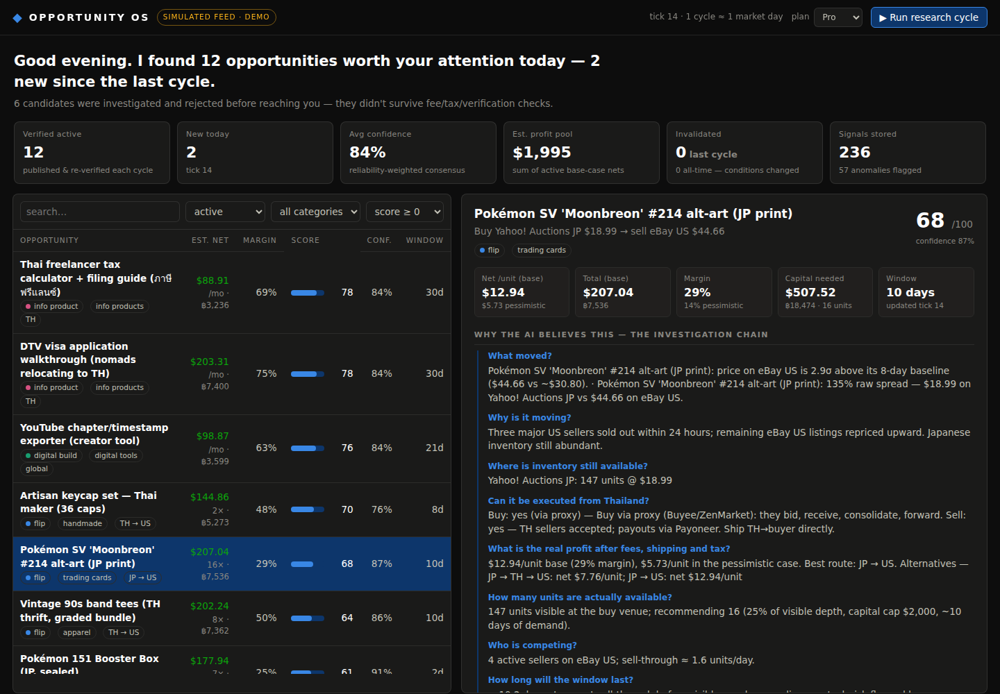

# ◆ Opportunity OS

**An opportunity-intelligence platform.** Not another chatbot: a fleet of research agents
observes market signals 24/7, notices anomalies, investigates *why*, verifies candidates
through an independent council, prices them down to the last baht of fees/shipping/tax,
scores them, writes the execution playbook — and then keeps re-verifying them so stale
advice dies the moment the market turns.

The user never asks *"give me a business idea."* The platform wakes up and says:

> **Good morning. I found 12 opportunities worth your attention today** — 2 new since the
> last cycle. 3 previously published opportunities were invalidated as market conditions
> changed. 6 candidates were investigated and rejected before reaching you.



Built for an operator based in **Thailand** 🇹🇭 — every opportunity is screened for
buy/sell feasibility from Thailand (proxy services for JP marketplaces, Thai import
VAT/duty, Thailand Post/EMS routes, Payoneer/Wise/PromptPay rails, CN22 paperwork,
and post-2025 US de-minimis duty risk priced into the pessimistic case).

**v1.0** is the full research-to-execution system:

* **Research** — 10 opportunity generators (cross-market flips, listing dislocations,
  refurbishment, **import/export** into or out of Thailand, **wholesale** lot break-ups,
  local-service/B2B gaps, digital/info products, micro-SaaS) over a product knowledge
  graph with bounded, EV-ranked expansion; one API response is strip-mined for many
  candidates.
* **Honesty** — every claim sits in an evidence ledger (observed/estimated/calculated/
  assumption/**unknown**); verification levels cap single-source, asking-price-only work
  below "execution ready"; duplicate listings cluster into one market thesis; rejections
  carry a taxonomy; `python -m opportunity_os diagnose_sources` proves which integrations
  actually work.
* **Thailand executability** — 10 concrete questions (register? payout? company?
  customs? still profitable?) answered or honestly marked unknown, gating "execution
  ready".
* **Capital** — an optimizer (not a ranking): risk tolerance, per-deal/category caps,
  liquidity reserve, worst-case loss and completion dates, deduplicated by thesis.
* **Execution** — every opportunity has its own persistent chat workspace: product-match
  protection (never buy the AGS-001 when the edge is the AGS-101), live link checks,
  price re-decisions at *your* price (BUY/NEGOTIATE/WAIT/SKIP), listing drafts, a
  transaction ledger with realised P&L, and a state machine that always knows the next
  action. It researches and records — it **never** buys, pays or publishes without you.
* **Security** — HTTPS always, admin-token-gated key management, credentials encrypted
  at rest, CSRF + rate limiting. See [SECURITY.md](SECURITY.md).

---

**New here? Read [docs/GETTING_STARTED.md](docs/GETTING_STARTED.md)** — plain-language
setup, what works with zero API keys (Thai e-commerce arbitrage does), and how to get
the free keys when you want them.

## Quickstart

```bash
pip install -r requirements.txt

python run.py serve            # dashboard + API at http://127.0.0.1:8000
                               # agents auto-run a research cycle every 180s
```

CLI, for the cron-driven lifestyle:

```bash
python run.py cycle -n 3       # run three research cycles right now
python run.py brief            # print the morning briefing to the terminal
python run.py reset            # wipe state and re-seed the demo world
python -m pytest tests/ -q     # 250 tests
```

No database server, no build step, no API keys needed to try it: state is SQLite
(`data/`, auto-created), the frontend is dependency-free vanilla JS, and demo mode runs
on a built-in simulated market (see **Demo mode & honesty** below).

## Live mode (real data)

The same pipeline runs on real connectors — eBay Browse API (sell side), Reddit
(demand), Google News RSS (context), live FX — over a watchlist you curate, with
your own buy-side quotes for venues that have no API (Buyee/Shopee/Facebook).
Observations persist in SQLite so baselines accumulate across days; sources that
fail degrade gracefully and are reported on `/api/health` and the LIVE badge.

**Discovery engine.** Live mode is no longer limited to the watchlist you type:
a discovery layer sweeps the open internet each cycle and auto-promotes the best
candidates into the observed set, where the normal verify → price → gate → learn
pipeline takes over. Sources: Google Trends (keyless), **Ask HN unmet-need posts**
(keyless — people literally asking for tools that don't exist), Reddit commerce
*and* business-gap subreddits (r/Flipping, r/SomebodyMakeThis, r/sweatystartup,
r/SaaS, …), and an eBay category sweep. It hunts business opportunities — digital
tools, info products, local services, B2B gaps — not just product flips. The
eBay + Reddit keys make it most productive; without them the two keyless sources
still run. See `GET /api/discovery`, the **Discovery** tab in the dashboard, and
the discovery panel in `run.py live-check`.

**AI brain (optional, recommended).** Set `ANTHROPIC_API_KEY` and Claude judges
every discovery sweep in one batched call: drops non-commercial noise, corrects
categories, rescores by real money-making potential for a Thailand-based
operator, and attaches a one-line reason to each verdict. Without the key,
keyword heuristics do the filtering. The AI never invents opportunities and
nothing it keeps skips verification — it only decides what deserves the fleet's
attention. (`opportunity_os/ai.py`; a few cents/day at the default cadence.)

**AI selling kits — from verified deal to posted listing.** The same key powers
the execution layer: one tap in an opportunity's detail page writes everything
needed to act on it — for flips, a ready-to-paste eBay listing (English), a
Shopee/TikTok Shop listing (Thai), the polite Thai message to send the source
seller, hashtags and a pricing rule; for ventures, the smallest sellable first
version, bilingual landing copy, three launch posts and a day-by-day first
week. Kits are cached in SQLite (regenerate on demand) and grounded only in the
opportunity's verified data. Because listing well is the actual gap between
"the robot found a deal" and "money arrived".

**Instant deal alerts.** In live mode with Telegram configured, the server
pushes a message the moment a *new* opportunity verifies (refreshes stay
quiet) — windows run in days, so waiting for the 07:00 briefing can cost most
of the edge.

```bash
cp watchlist.example.json watchlist.json   # what to track
python run.py serve --live                 # observe every 30 min, publish what verifies
```

**API keys without the terminal:** open the dashboard → **⚙ Keys** tab →
paste → Save. Keys apply immediately (no restart), are stored only in the
local SQLite database, and are never sent back to the browser (masked
previews only). The **🧪 Test connections** button live-checks every key.
`docs/KEYS.md` is the step-by-step guide for getting each key — including
the eBay compliance trap and Reddit's 2025 approval rules. Prefer files?
`cp .env.example .env` still works exactly as before; app-saved keys win
over `.env`. Validate everything with `python run.py live-check`.

**Full operator guide + DigitalOcean deployment (systemd units, daily Telegram
briefing at 07:00 Bangkok): [docs/LIVE.md](docs/LIVE.md).** Demo and live keep
separate databases (`data/live.db`) — the mode guard refuses to mix them.

---

## How a cycle works

One research cycle ≈ one market day:

```
        13 scanner agents                    the "why?" engine
  ┌──────────────────────────┐        ┌─────────────────────────────┐
  │ eBay US · Amazon US      │        │ What moved?                 │
  │ Yahoo!Auctions JP        │ signal │ Why is it moving?           │
  │ Mercari JP · Etsy        ├──────► │ Where is inventory?         │
  │ Shopee TH · Lazada TH    │        │ Executable from Thailand?   │
  │ Facebook MP TH · Kaidee  │ anomaly│ Real profit after fees/tax? │
  │ Reddit · TikTok · X      ├──────► │ How many units? Who         │
  │ Google Trends · News     │        │ competes? How long?         │
  └──────────────────────────┘        └──────────────┬──────────────┘
                                                     │ candidate
     ┌───────────────────────────────────────────────▼──────────────┐
     │  VERIFICATION COUNCIL — independent re-checks, any critical  │
     │  failure vetoes: price_verifier · supply_verifier ·          │
     │  demand_estimator · fee_auditor · tax_auditor ·              │
     │  competition_analyst (reliability-weighted consensus)        │
     └───────────────────────────────────────────────┬──────────────┘
                                                     │ verified only
     ┌───────────────────────────────────────────────▼──────────────┐
     │  ECONOMICS GATES: base margin ≥ 10% · pessimistic scenario   │
     │  (−5% price, +15% shipping, +fees, US destination duty,      │
     │  3% mishap reserve) must STILL be profitable                 │
     └───────────────────────────────────────────────┬──────────────┘
                                                     │
        score (10 weighted factors) ► playbook ► automation plan
                                                     │
     ┌───────────────────────────────────────────────▼──────────────┐
     │  PUBLISH … then RE-VERIFY every active opportunity on every  │
     │  later cycle → INVALIDATED with a reason when the edge dies  │
     └──────────────────────────────────────────────────────────────┘
```

The part most tools skip is the last box. Opportunities decay — a restock lands, a
dealer floods the market, a fad fades. Opportunity OS treats **constant re-validation
as the core feature**: in the demo you can literally watch the Pokémon 151 booster-box
flip get published after a US supply shock and then get invalidated seven cycles later
when the distributor restock hits, with the reason attached.

### Every opportunity ships with evidence, not vibes

* **Why-chain** — the full investigation Q&A, grounded in observed data
* **Cost waterfall** — acquisition, proxy fees, every shipping leg, Thai VAT/duty,
  marketplace commissions, payment/FX spread, in USD and THB, base *and* pessimistic
* **Verification council transcript** — each check, its evidence, its confidence
* **Score breakdown** — 10 factors (margin, demand, competition, risk, difficulty,
  capital, time, market size, repeatability, automation), weights visible
* **Thailand lens** — can you buy it, can you sell it, which proxy, which customs form
* **Playbook** — supplier, quantity, price caps, carrier, pre-written listing with a
  pricing rule, repricing/exit rule, payout route
* **Automation plan** — which steps a machine can run, and the human checkpoints

### Categories covered

Product arbitrage (JP auctions → eBay US, TH exclusives → US, thrift → export),
digital builds (micro-SaaS, creator tools), info products (incl. Thai-language niches
like ภาษีฟรีแลนซ์ guides), local services (Bangkok), and B2B gaps (e.g. EV charger
installation partnerships).

### The learning loop

Record what actually happened (`POST /api/opportunities/{id}/outcome`, or the form in
the dashboard). Outcomes update:

* **confidence calibration** — an over-promising system automatically gets humbler,
* **source/verifier reliability** — scanners that fed winning calls gain consensus weight,
* **scoring weights** — fail on competition and the competition factor weighs more.

### Revenue model (implemented as real gates)

| Plan | Gets |
|---|---|
| Free | 3 verified opportunities / week, no playbooks |
| Pro | full daily feed + playbooks + automation plans |
| Team | Pro + API access + shared workflows |
| Enterprise | custom industry monitoring |

Switch the plan picker in the dashboard and watch the feed gate itself.

---

## Demo mode & honesty

**Everything you see in demo mode is simulated.** The scanners consume a deterministic
in-process market (`opportunity_os/market/world.py`) with *causal* events — a US
sellout, a TikTok spike, a restock, a competitor pile-in — that the pipeline has to
discover from observable data. The simulator never hands answers to the agents; it just
makes the world observable, so the entire pipeline is exercised honestly end-to-end.
Fees, duty rates, shipping and FX are approximate early-2026 reference values.

**Going live is an interface swap, not a rewrite.** Scanners talk to the `DataSource`
protocol (`opportunity_os/market/__init__.py`). Implement it with real adapters —
suggested APIs per venue are listed in `opportunity_os/market/live.py` — and pass a
`LiveMarket` to the `Orchestrator`. The hard product problem (verify → price → gate →
re-verify → learn) is already built and tested. The demo UI carries a permanent
**SIMULATED FEED** badge; nothing here is financial advice.

---

## API

| Endpoint | What |
|---|---|
| `GET /api/briefing?plan=` | the morning briefing |
| `GET /api/opportunities?status=&category=&min_score=&q=&plan=` | the feed |
| `GET /api/opportunities/{id}?plan=` | full evidence package |
| `POST /api/opportunities/{id}/kit` | AI selling kit: ready-to-paste TH/EN listings (flips) or launch kit (ventures) |
| `POST /api/opportunities/{id}/outcome` | close the learning loop |
| `POST /api/cycle` | run a research cycle now |
| `GET /api/agents` · `GET /api/signals` · `GET /api/anomalies` | the fleet's raw work |
| `GET /api/discovery` | what the discovery engine auto-found and is watching (live) |
| `GET /api/learning` | weights, calibration, reliabilities, adjustments |
| `GET /api/stats` · `GET /api/thailand` · `GET /api/plans` · `GET /api/health` | meta |

## Repo map

```
opportunity_os/
  config.py          gates, plans, operator profile (capital cap, TH home base)
  models.py          Signal → Anomaly → Investigation → Verification → Opportunity
  economics.py       venues, fee tables, shipping rate card, routes, cost waterfalls
  thailand.py        platform access from TH, import VAT/duty, customs, payment rails
  market/world.py    deterministic causal market simulator (demo mode)
  market/live.py     live data source (watchlist + discovery, real adapters)
  discovery.py       discovery engine — auto-finds new products/niches to watch
  plugins/           drop-in scanner plugins (one file = one new source)
  ai.py              AI brain — discovery judgment, risk desk, selling kits
  (docs/ARCHITECTURE.md — the audit, scaling design and source roadmap)
  agents/scanners.py 13 scanner agents (venues, social, trends, news)
  agents/anomaly.py  z-scores, stock crashes, spreads, gaps, imbalances
  agents/investigator.py   the why-chain + candidate builder
  agents/verifiers.py      the verification council
  agents/scoring.py        10-factor explainable scoring engine
  agents/playbook.py       execution playbooks + automation plans
  agents/learning.py       outcomes → calibration/reliability/weight updates
  pipeline.py        the orchestrator (cycle + re-verification) and briefing
  db.py              SQLite store
  api.py             FastAPI app + plan gating + dashboard host
web/                 zero-build dashboard (index.html / style.css / app.js)
tests/               35 tests: economics, thailand, agents, pipeline, API
run.py               serve · cycle · brief · reset
```

## Roadmap to production

1. ~~**Live connectors**~~ — ✅ shipped: eBay Browse (sell side), Reddit, Google
   News RSS, live FX, ScrapingDog/Shopee TH, manual buy-side quotes
   (`market/adapters.py`, `market/live.py`).
2. ~~**Discovery + AI judgment**~~ — ✅ shipped: Google Trends / Reddit / eBay
   discovery sweeps with an optional Claude classification layer
   (`discovery.py`, `ai.py`).
3. ~~**Notifications**~~ — ✅ shipped: Telegram briefing push + daily systemd timer.
4. **Buy-side automation** — Buyee/ZenMarket quote fetching for JP auctions and an
   AliExpress price watcher, so cross-border flips price themselves end to end
   (today the buy side is your manual quotes).
5. **Real fee/tariff sync** — marketplace fee schedules, Thai Customs tariff codes,
   carrier rate APIs (fees/duties are curated reference values today).
6. **Execution integrations** — proxy-service auto-bid, listing APIs, label printing
   (the automation plans already mark what to wire).
7. **Accounts & billing** on top of the plan gates that already exist (today the
   plan switch is client-side — fine for a personal tool, not for paying users).
