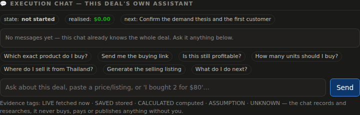

# Opportunity OS — Architecture, Audit & Scaling Roadmap

The objective function, stated once and used to judge every idea below:

> **Maximize the expected dollar value of published opportunities per unit of
> API budget and operator attention.** Scan count is an input cost, not a KPI.
> 20 high-confidence opportunities beat 20,000 weak ones.

## v1.0 — final: the chat interface + the audited whole

v1.0 closes the last mandate item: the execution chat's **interface** — a chat
panel on every opportunity's detail view (state + realised P&L + next action
strip, evidence-tagged history where every reply shows LIVE/SAVED/CALCULATED/
ASSUMPTION/UNKNOWN chips, one-tap prompts, free-text box), a verification-level
chip in the detail header so single-source work is visibly labelled, the exact
`python -m opportunity_os diagnose_sources` entrypoint, and per-source
`candidates_generated` in the health report. The full phase 0–13 mandate was
re-audited item by item against the code with a scripted evidence run — every
check passes, and the acceptance criteria live on as `tests/test_acceptance.py`
+ `tests/test_chat.py` so they cannot silently regress.



## 0. v0.12 — per-opportunity execution chat + acceptance (Phases 12/13)

Every opportunity now has a **persistent execution workspace** scoped to its id
— not general chat, an assistant that drives ONE deal from research to realised
profit, from Thailand.

* **`chat.py` / `chat_tools.py` / `execution.py`** — a `ChatSession` scoped to
  one opportunity id, with its own message history, checklist, transaction
  ledger and execution state (`not_started → researching → ready_to_buy →
  purchased → in_transit → received → listed → sold → completed`, plus
  cancelled/invalidated). Fifteen deterministic tools: refresh buy/sell
  listings, sold-comp check, recalc profit/qty, price decision, find
  alternative suppliers, live link check, inventory, validity, compare a pasted
  listing, generate a listing draft, update checklist, record purchase/expense/
  sale/refund, escalate re-verification. **It researches, recalculates, drafts,
  validates and records — it never transacts** (no tool buys, pays, publishes,
  accepts an offer, cancels or refunds), which is the human-approval guarantee,
  enforced structurally.
* **`matching.py`** — a product-match engine (EXACT / LIKELY / POSSIBLE_MISMATCH
  / WRONG_PRODUCT / INSUFFICIENT_INFO) so the AGS-101 doesn't turn into the
  cheaper AGS-001; a price-decision engine that re-decides at the *current*
  offered price (BUY / NEGOTIATE / WAIT / SKIP with the max buy price); and a
  live link validator that actually fetches the URL and records when — never
  inventing a listing, price or seller.
* **Grounding + isolation** — every factual answer is tagged LIVE / SAVED /
  CALCULATED / ASSUMPTION / UNKNOWN, comes from a tool result or the stored
  evidence ledger, and the chat says "I don't have that evidence" rather than
  inventing. Claude (when keyed) only phrases grounded facts. Each opportunity's
  workspace is isolated by id — two chats never share state. Everything
  persists across restart.
* **Phase 12** — the acceptance criteria are codified as tests
  (`test_acceptance.py`): source-health report, no silent failures, evidence
  traceable, dedup + metrics, ≥5 generator types, ≥3 non-flip, verification
  levels, Thailand gate, no fabrication, and the chat surface. The 12 chat
  acceptance scenarios are in `test_chat.py`. All run without an LLM — the
  substance is deterministic.

## 0. v0.11 — dedup, Thailand executability, capital optimizer (Phases 6/10/11)

* **Thesis clustering (`clustering.py`, Phase 6)** — twenty underpriced listings
  of one model are ONE market inefficiency. `cluster` collapses opportunities
  sharing a thesis key (type + route + product family) into a single row that
  carries the depth — qualifying-listing count, price range, inventory depth,
  recommended quantity, best confidence — instead of repeating the edge N
  times. The feed clusters by default (`?cluster=false` to see every listing);
  `cluster_metrics` reports raw candidates → unique listings → unique products →
  unique theses with an inflation ratio, so "N verified" is readable for what
  it is.
* **Thailand executability engine (`executability.py`, Phase 10)** — every
  opportunity answers the concrete questions a TH operator has: can a Thai
  resident register on the buy/sell platform, is a Thai-usable payout available,
  is a company required, are there category import/export restrictions, what
  shipping and customs docs apply, are TH taxes in the numbers, is it still
  profitable pessimistically. Each answer is yes/no/estimated/**unknown** —
  and an opportunity cannot be EXECUTION_READY (Phase 7) while any critical
  answer is unknown or a blocker. Nothing is guessed.
* **Capital optimizer v2 (`research.allocate_capital`, Phase 11)** — solves for
  the best use of finite capital, not a ranking: inputs are the budget, a
  per-opportunity cap, a category concentration cap, a risk tolerance
  (conservative prices on pessimistic net and admits only multi-source+;
  aggressive admits all), a liquidity reserve, and a max holding time; outputs
  per pick are quantity, capital, expected profit, WORST-CASE loss (from a
  kind-specific liquidation recovery), completion date and the opportunity cost
  of the tied-up cash — plus portfolio totals and cash remaining.
  **Deduplicated by thesis**, so 20 listings of one edge draw capital once.
  Surfaced in the daily briefing.

## 0a. v0.10 — evidence, verification levels, honest funnels (Phases 7–9)

"Verified" used to be a single boolean. Now it means something graded, and
every number behind it is traceable:

* **Evidence ledger (`evidence.py`, Phase 9)** — each opportunity carries a
  list of `EvidenceItem`s: what the claim is OF, its value, its KIND (observed
  / estimated / calculated / assumption / user-supplied / ai-interpretation /
  unknown), the source, whether it counts as an *independent* corroboration,
  the raw-record id and freshness. Economics are always `calculated`, a Browse
  price is `observed` but explicitly labelled *asking, not a sold comp*, and
  counterfeit/condition risk is honestly `unknown` rather than faked.
* **Verification levels (Phase 7)** — `compute_level` grades from the ledger,
  not from "it passed": DISCOVERED → PARTIALLY_VERIFIED → MULTI_SOURCE_VERIFIED
  → EXECUTION_READY → INVALIDATED. An opportunity whose evidence all comes from
  one marketplace is `single_source` and capped at PARTIALLY_VERIFIED; nothing
  reaches EXECUTION_READY on asking prices alone (it needs sold comps or a
  third independent corroboration). Measured on demo: cross-market flips and
  corroborated ventures reach multi-source; single-venue dislocations stay
  partial — exactly the honesty the audit asked for.
* **Rejection taxonomy + funnels (Phase 8)** — every rejection is classified
  into a fixed taxonomy (margin_below_threshold, unsupported_thailand,
  insufficient_supply, low_confidence, stale_data, …) and aggregated per type
  in `rejection_funnel`; `type_funnel` now also breaks down by verification
  level and counts single-source opportunities. So "lots rejected" becomes a
  map of *why*.
* **AI as investigator, not oracle (Phase 9)** — the risk desk is handed the
  evidence ledger as its ONLY ground truth, forbidden from inventing prices/
  volumes/fees/eligibility, and required to name `missing_evidence` instead of
  guessing. Its verdict is stored as an `ai_interpretation` evidence item —
  never as fact — and its named gaps become `unknown` items on the ledger.

## 0b. v0.9 — sources ≠ generators, and a knowledge graph (Phases 3–5)

The diversity problem ("almost every result is an eBay flip") had a structural
cause: the pipeline conflated **data sources** with **opportunity generators**,
and only the flip path had a complete generator. v0.9 separates them:

* **`generators.py` — a generator registry** decoupled from scanners. A source
  collects evidence; a generator combines evidence into a business thesis; the
  same council gates them all. Eight generators register today
  (`cross_market_flip`, `dislocation`, `digital_product`, `info_product`,
  `local_service`, `b2b_service`, `micro_saas`, `bundle_repair`), five+ distinct
  opportunity types, and a broken generator can never break a cycle. Not every
  generator touches a marketplace.
* **Non-flip generators that produce real candidates** — the venture family
  split by kind (digital / info / local-service / B2B), a distinct
  `micro_saas` thesis (strict evidence: real demand growth + genuinely weak
  supply, mutually exclusive with generic digital so demand isn't double-
  counted), and `bundle_repair` — a **refurbishment** thesis mined from a
  product's own ask distribution (buy a for-parts unit far under working comps,
  repair, resell). Refurb economics carry a real parts+labour cost and a
  pessimistic scrap reserve, and only fire on genuinely repairable categories
  (gaming/electronics/cameras/watches) — never a sealed collectible.
* **`graph.py` — the product & opportunity knowledge graph** (Phase 5).
  Normalized nodes (product/brand/model/accessory/part/niche/seller/outcome)
  and typed edges (variant-of, compatible-with, co-listed, previously-
  profitable/rejected). A verified opportunity marks its product profitable and
  seeds co-listing edges from its own page; a **bounded, EV-ranked traversal**
  (`related_hypotheses`) then turns that one win into related hypotheses —
  "profitable Seiko chronograph → check the service dial, the jubilee bracelet"
  — promoted into discovery. Traversal is capped (never unbounded fan-out) and
  scored by expected value per API request, steering toward proven neighbors
  and away from previously-rejected ones.

Measured (demo, same budget): opportunity types went from ~all
`product_arbitrage` to a spread across `product_arbitrage`, `local`,
`micro_saas`, `info`, `refurbish`; a verified discovery now spawns ~20+ related
hypotheses for the fleet to investigate next. Every candidate still faces the
council and the pessimistic economics gate.

## 0. v0.7 — the alpha-density rewrite (the single biggest bottleneck)

**The bottleneck was never compute or scanner count. It was how much alpha we
extracted from each API response.** Every eBay call returns ~50 individual
listings — a whole distribution, every seller, every exact URL — and the old
pipeline collapsed all of that into ONE number (the median price) and threw the
rest away. One API call → at most one signal. That is the ceiling that kept us
at ~3 verified opportunities/day, and no amount of "more scanners" moves it.

The redesign treats every response as a **graph of information**, not a price.
The new `research.py` core turns one call into many independent candidates:

1. **Dislocation detection (the richest source).** Within a single response,
   `find_dislocations` finds individual listings priced far below the market's
   own *conservative* clearing value (median of the cheapest page's upper half
   — deliberately below the true market median). Each hit is an intra-venue
   flip with an **exact URL**, needing no second venue and no price history —
   the edge is *inside* one response. Junk ("for parts", "box only", repros)
   and wrong-model-number variants are filtered before they can masquerade as
   bargains. `find_liquidation` spots one seller dumping several below-fair
   asks — an estate/closing sale worth sweeping.
2. **Full ask-distribution microstructure.** `market_stats` reads fair value,
   p25/p75, dispersion, seller count and **top-seller concentration** from the
   same page — turning "the price" into the shape of the whole market.
3. **Title mining → graph fan-out (free candidates).** Sellers write the
   product graph into their titles. `mine_related` extracts recurring model
   variants / adjacent products across a page and promotes the strongest as
   **new discovery candidates plus graph edges — zero extra API calls.** One
   response about a Game Boy SP seeds the Pokémon-edition variant, the boxed
   edition, the adjacent handheld.
4. **Opportunity propagation.** When an entity produces a *verified* opportunity,
   the pipeline **boosts the discovery priority of its graph neighbors** — so
   finding one edge pulls the fleet toward the cluster around it.

Two more quant-desk pieces sit on top of the richer candidate stream:

5. **EV research-budget allocator (a bandit, not a rota).** `ucb_rank` orders
   the scan tail by *verified research yield per scan* (anomaly/candidate/
   publication rewards) with a UCB exploration bonus, so the fixed API budget
   flows to whatever is actually PRODUCING opportunities while still probing the
   unknown. The `research_yield` ledger accrues every scan/anomaly/candidate/
   publication per entity.
6. **Capital optimizer (allocate, don't just rank).** `allocate_capital` solves
   for the best use of the operator's finite capital: greedy over net-per-dollar-
   per-day, capped per category for diversification, respecting the real budget
   — returning an execution order, deployed vs reserve capital, and expected
   ROI. Surfaced in the daily briefing as `capital_plan`.

**Measured effect (demo, same API budget):** anomalies per cycle ~5 → ~50,
investigated candidates ~5 → ~20, verified active opportunities ~3 → ~14, each
dislocation carrying the exact listing URL to buy. The honesty bar did not move:
every candidate still faces the council and the pessimistic fee waterfall, and
same-venue dislocations must clear the venue's round-trip take — thin ones die
in the gate, which is exactly why the survivors are real.

Everything above is exercised in **demo mode too**: the simulator synthesizes a
faithful page of asks per listing (spread, sellers, junk, recurring variants,
and an occasional genuine dislocation) so the alpha engine runs on demo data
exactly as it runs on eBay data — clearly synthetic, never shown to the user as
real listings.

## 1. The pipeline (target vs actual)

The requested architecture and the shipped one, stage by stage:

| Target stage | Implementation | File |
|---|---|---|
| Raw data sources | Adapters + discovery sources + **plugin registry** (drop-in file = new scanner) | `market/adapters.py`, `discovery.py`, `plugins/` |
| Historical data lake | Append-only, timestamped SQLite series: prices, stock, sellers, sell-through, mentions, niche metrics, headlines, FX | `db.py` (`live_*` tables) |
| Signal detection | 11 independent detectors (see §3) over rolling baselines | `agents/anomaly.py` |
| AI investigation | Why-chain builder + Claude risk desk on every new publication (edge + concrete risks + verdict) | `agents/investigator.py`, `ai.py` |
| Economic simulation | Full cost waterfall (fees, ship legs, TH VAT/duty, US destination duty, FX) in base + pessimistic scenarios, lot-size aware | `economics.py` |
| Risk analysis | Pessimistic-survival gate + AI risk review + Thailand feasibility screen | `pipeline.py`, `thailand.py` |
| Verification council | 6 reliability-weighted checks, critical-veto semantics | `agents/verifiers.py` |
| Opportunity feed | Feed + evidence package + selling kits + instant alerts | `api.py`, `web/` |
| Feedback loop | Outcomes → calibration, source/verifier reliability, scoring weights | `agents/learning.py` |

## 2. Audit — bottlenecks found (and status)

Ordered by impact on expected-value throughput:

1. **Flat rescan schedule** *(FIXED)* — every entity was rescanned every
   cycle, so the eBay budget capped coverage at ~60 markets. Now tiered:
   hot (watchlist, active opportunities, fresh anomalies) every cycle; warm
   (best discoveries) every 4th; cold tail every 12th, offset per entity so
   per-cycle load is flat. **Same budget → ~200 watched markets.**
2. **Signal engine breadth** *(FIXED)* — only 7 detector types. Added 4 that
   read data we already store: `seller_exodus` (competitors leaving),
   `demand_acceleration`, `margin_expansion` (spread widening — catches an
   edge while it grows, not at the top), `trend_reversal` (niche turning up).
3. **Hardcoded source registration** *(FIXED)* — new scanners required core
   edits. Now: one file in `opportunity_os/plugins/`, `@discovery_source` or
   `@venue_adapter("id")`, done. A broken plugin is skipped, never fatal.
4. **No qualitative risk stage** *(FIXED)* — quantitative gates can't see
   counterfeit exposure, platform-policy risk, or fad decay. The AI risk desk
   now reviews every first-time publication and must name the *edge* — if no
   plausible reason exists for the mispricing, that itself is flagged.
5. **Buy-side asymmetry** *(PARTIAL — biggest remaining)* — sell side (eBay)
   is automated; buy side is automated only for Shopee TH (ScrapingDog
   pairing, capped 8). JP proxy venues (Buyee) have no API: cross-border JP
   flips still need manual quotes. See roadmap.
6. **Single-process sequential fetching** *(ACCEPTED for now)* — ~45-65
   HTTP calls per cycle, serial, ≈30-60s per pass at a 30-min cadence. The
   binding constraint is API allowances, not wall time; concurrency buys
   nothing until we're allowance-rich. Revisit at 500+ entities.
7. **Signals/anomalies tables are capped** *(ACCEPTED)* — they're derived
   data, re-derivable from the append-only series. The load-bearing history
   is never overwritten.
8. **No FX/fee history series** *(P2)* — only latest FX is stored.

## 3. Signal detectors (each independent, each a reason to investigate)

Price z-spike · supply crunch · cross-venue spread · social spike ·
search gap · service imbalance · B2B surge · **seller exodus** ·
**demand acceleration** · **margin expansion** · **trend reversal** ·
**price dislocation** (v0.7 — a single ask far below its market's fair value,
the highest-yield detector because it fires per-listing, not per-market) ·
**seller liquidation** (v0.7 — one seller dumping several below-fair asks).
Planned (need data we don't store yet): review velocity, rank changes,
seasonality (needs ≥1y of history — accumulating now).

## 4. Source feasibility matrix (the honest version)

| Requested source | Verdict | Why |
|---|---|---|
| eBay | ✅ live | Browse API, 5k calls/day free — the volume backbone |
| Google Trends, Hacker News, News RSS | ✅ live, keyless | |
| Reddit | ✅ built (key pending approval) | Serper stands in meanwhile |
| Serper (Google) | ✅ built | demand stand-in + future Shopping prices |
| Shopee TH | ✅ live via ScrapingDog | scraping fragility priced in |
| Etsy | 🔶 feasible next | free API, app approval takes days — good P1 plugin |
| Rakuten JP | 🔶 feasible next | free Webservice API — template plugin shipped |
| Mercari US | 🔶 possible | unofficial endpoints, scraper needed |
| Amazon (any country) | 🔶 gated | PA-API needs an affiliate account with 3 sales; realistic path is Keepa (€19/mo) |
| Yahoo Auctions / Mercari JP | 🔶 via paid scraping only | no public API; Buyee scraping is brittle — P1 experiment |
| Lazada / TikTok Shop | 🔶 seller-only APIs | scraper route only |
| Taobao / 1688 | ❌ rejected | requires CN business registration; scraping is an arms race not worth one operator's capital |
| Facebook Marketplace | ❌ rejected | no API, aggressive anti-bot, ToS risk to the operator's personal account |
| X / Twitter | ❌ rejected | $100+/mo for weak commerce signal |
| Patents, import/export stats, gov registrations, filings | ❌ rejected *for this operator* | institutional-grade sources whose signals a $500-capital solo flipper cannot act on; revisit if the platform ever serves B2B users |
| YouTube, Product Hunt, GitHub | 🔶 P2 plugins | free APIs, niche-demand signal for the venture side |

## 5. Roadmap (highest expected-value first)

**P1 — next**
1. *Serper Shopping venue* — Google Shopping as a second US sell-side price
   (corroborates eBay, extends coverage to new-goods retail).
2. *Etsy + Rakuten plugins* — two real, free APIs; Rakuten opens the JP buy
   side legitimately (no proxy scraping).
3. *Probability output on economics* — triangular price/velocity/fee draws →
   P(profit>0) and P10/P50/P90 displayed per deal.
4. *Buyee scraping experiment* behind ScrapingDog — the JP buy side is the
   single most valuable missing dataset; ship as an EXPERIMENTAL adapter with
   the same honesty labels as Shopee.

**P2**
5. FX + fee history series; seasonality detector once a year of data exists.
6. Concurrent fetch pool when entity count clears ~500.
7. Review-velocity + rank-change detectors (requires storing review counts —
   Keepa or Etsy provide them).

**Non-goals** (rejected on the objective function): distributed workers and
queues at this scale (a 1-GB droplet handles 10k entities in SQLite; the
constraint is API allowances), lowering verification gates to inflate counts,
and any source whose signal the operator cannot act on with current capital.

## 6. Writing a scanner plugin (the 5-minute version)

```python
# opportunity_os/plugins/mysource.py
from opportunity_os.discovery import Candidate, DiscoverySource, clean_query, slug
from opportunity_os.plugins import discovery_source

@discovery_source
class MySource(DiscoverySource):
    id, name = "mysource", "My Source"

    def discover(self):
        # fetch → filter hard → return candidates; fail with self._fail(msg)
        return [Candidate(kind="product", id=slug("thing", "disc_p"), name="Thing",
                          source=self.id, score=0.7,
                          queries={"ebay_us": clean_query("thing")})]

    def check(self):
        return True, "ok"
```

Drop the file in, restart. It's judged by the AI brain, capped by the engine,
observed by the tiered scheduler, and gated by the council like everything
else. That contract — *plugins propose, the pipeline disposes* — is what lets
source count grow 100× without the quality bar moving an inch.

## 7. v1.1.0 — why the live feed was all eBay-US flips, and the fix

The audit question: *"with eBay, Serper, ScrapingDog and Claude all
configured, why is the visible output still eBay-US buy-and-resell flips?"*
Root causes found (file:line refs are pre-fix):

1. **Discovered niches shipped with fabricated baselines** —
   `discovery.py` `to_watch_niche()` gave every discovered niche
   `base_volume=1500, solution_count=3, providers=3, demand_posts=60`.
   Consequences: the council's "supply-side gap confirmed" check
   (`verifiers.py`, `solution_count <= 4`) passed **by construction**; venture
   economics monetised an invented volume; the evidence ledger labelled the
   invented supply `OBSERVED/market_scan`. Live-mode non-flip output was
   either fiction or (in practice) nothing.
2. **Serper's evidence was discarded** — the adapter returned only
   `len(organic)` for a `site:reddit.com` query. Titles, URLs, snippets,
   People-Also-Ask, related searches — the actual competitor/complaint/gap
   evidence — were thrown away. ScrapingDog was Shopee-price-only.
3. **No source spoke Thai** — trends geo defaulted to US, eBay seeds are
   US-liquid products, the niche-kind classifier only knew English words.
   Thailand local/B2B candidates could not *enter* the funnel.
4. **Scan-budget asymmetry** — products got tiered scans every cycle; niches
   got ≤12 coarse counts every 12th cycle, so venture demand series starved
   while flip evidence compounded.

The v1.1.0 fix, mechanically:

* `SerperAdapter.demand_observation / supply_observation / search` — full
  parsed results stored in the new `live_search_obs` table (query, geo,
  language, timestamp, payload verbatim). Supply = distinct commercial
  domains ranking for the niche (directories/social filtered out) — an
  observed, reproducible proxy replacing the constant `3`.
* `LiveMarket._niche_metrics` now emits **provenance**:
  `observed: {demand: observed|user_supplied|unknown, supply: …}`. Discovered
  niches start at 0/unknown; hand-typed watchlist numbers stay the operator's
  own (and a 0-provider scan never silently overwrites them).
* `verify_venture`: unknown supply **fails** the critical gap check with
  "research required" — a venture can no longer verify on unobserved supply.
  Observed supply cites the domains found. Demo metrics (no provenance key)
  keep simulator semantics.
* `evidence.build_ledger`: venture demand/supply items carry their true kind
  (OBSERVED / USER_SUPPLIED / UNKNOWN) and source (serper / watchlist), so
  the AI risk desk and the UI can no longer be lied to by defaults.
* **`SerperGapDiscovery`** — Thai + English unmet-need mining (rotating
  templates against google.co.th and reddit-scoped English gaps), harvesting
  People-Also-Ask + related searches + result titles through the same
  gap-relevance filter (now Thai-aware, `GAP_PATTERNS_TH`). Thai candidates
  carry `serper_query_th`, so the measurement pass keeps observing their
  demand *in Thai* and their supply. Budgeted: `OOS_SERPER_DISCOVERY_BUDGET`
  (6/sweep) + `OOS_SERPER_NICHE_BUDGET` (12/pass) ≈ under ~60 credits/day.

What this changes about the product: with a Serper key set, the funnel's
non-flip lanes run on real, cited evidence end to end — and when evidence is
missing, the candidate is *visibly* research-required instead of silently
fictional. Without a Serper key, the diagnostics now say exactly that
(`no SERPER_API_KEY — niche demand/supply stays UNOBSERVED (ventures cannot
verify)`), which is the honest description of the old behaviour too — it just
never admitted it.

## 8. v1.2.0 — import/export + wholesale generators (2 of the 4 missing types)

Two of the generators the mandate named (8: import/export, 10: wholesale) did
not exist. Both now do, as **strictly additive** generators with their own
`OppType`s — no existing flip is relabelled, and clustering keeps every thesis
distinct (`test_import_export_is_not_a_duplicate_of_a_flip` proves it).

**`ImportExportGenerator`** (`generators_trade.py`). The profit-max flip picks
one route: global cheapest-buy → dearest-sell. For a Thai operator the most
*executable* route is often a different one, which the greedy flip hides:
- **import** — buy foreign, sell **domestically in Thailand** (PromptPay, no
  export paperwork). Emitted only when the headline flip ships abroad, so it's
  never the same card.
- **export** — source locally in Thailand, sell abroad. Emitted only when the
  headline flip sources abroad.
It gates on **observed destination demand** (a price gap with no sales isn't a
trade) and runs a **Thailand import legal screen** (`thailand.import_restriction`):
a prohibited product — vapes/e-cigs, etc. — is dropped and never suggested; a
licensed one (food → FDA, wireless electronics → NBTC) is surfaced *with* its
permit as a named cost, not hidden. Prices the full customs/VAT/duty waterfall
via the existing `compute_flip`.

**`WholesaleGenerator`** (`generators_trade.py`). Bulk **lots** inside a
venue's own listing sample — "lot of 12", "x20", "case of 24" — whose per-unit
price (`research.parse_lot_size` → price ÷ count) sits below the single-unit
market *on that same venue*, measured from the non-lot singles so a page of
lots can't flatter itself. Buy the lot, break it, resell as singles. A quantity
thesis with its own council check (`verify_wholesale`): the exact lot must
still be live, still below the single-unit fair, into a deep-enough singles
market, clearing pessimistic per-unit fees.

Both re-verify correctly (`_fresh_flip` preserves the stored type for
import/export; `_fresh_wholesale` re-reads the lot from the sample) and face
the same pessimistic-economics gate as everything else. Demo coverage: one JP
product shaped like a real hidden-import market (`casio_fx_jp`) and an
occasional synthetic bulk lot in `listing_sample`, so the two types appear in
the demo feed and the type funnel — clearly labelled synthetic, exactly like
the dislocation/refurbishment demo evidence.

**Still missing from Phase 9** (honest): lead-generation and seasonal/event
generators, the adaptive type-diversity discovery budget (Phase 10), and
ScrapingDog as a general evidence collector (Phase 7). Those remain real gaps.

## 9. v1.3.0 — the type-diversity budget (Phase 10)

The eBay-US-only bias had a third root cause beyond fabricated data (v1.1.0)
and missing generators (v1.2.0): **the watch set itself was monopolized.**
Physical products carry the richest evidence and score highest at discovery, so
the plain top-by-score promotion + expiry (`expire_discovered`) dropped every
gap-mined Thai niche the moment the watch set filled. Non-flip types were
starved of coverage before they could ever verify — measured directly:

```
diversity OFF : watched=50  physical=50  non-physical=0
diversity ON  : watched=50  physical=44  non-physical=6  (local/b2b/digital/info)
```

`diversity.py` allocates the watch budget across opportunity **families**
(physical trade / local service / B2B / digital / info), each with a reserved
floor, adapting the shares toward families that actually verify. Wired into
`DiscoveryEngine.run` at BOTH stages — promotion (which candidates get stored)
and retention (which occupy the finite `discovery_max_active` set) — so a flood
of products can neither out-promote nor out-live the niches.

Two rules are load-bearing:

1. **A family's budget governs how much it is WATCHED, never whether a candidate
   PUBLISHES.** Publishing still requires the full council + pessimistic gate. A
   family with a floor but no qualifying candidates simply under-fills, and the
   report says so (`under_filled: found < target`) — a buying-information state,
   never a weak opportunity waved through to hit a quota.
2. **Adaptation never zeroes a family** (`adapt_weights` floors each at half its
   base weight), so the system keeps buying information on the quiet families
   instead of collapsing onto today's winner. Surplus from under-filled families
   is redistributed by score, so no watch slot is wasted.

Surfaced at `GET /api/diversity` and in the dashboard Discovery tab (per-family
target vs watched vs verified, with an honest "buying info" flag). Knobs:
`OOS_DIVERSITY`, `OOS_DIVERSITY_MIN_FLOOR`, `OOS_DIVERSITY_ADAPT`.

**Remaining Phase-9/10 gaps** (honest): lead-generation and seasonal generators
(2 of the 4 missing types still unbuilt), and ScrapingDog as a general evidence
collector (Phase 7).

## 10. v1.4.0 — lead-gen + seasonal generators (the 11-generator set is complete)

The last two of the four generators the mandate named. All 11 opportunity
families now exist as real, evidence-backed generators facing the same council.

**`LeadGenGenerator`** (`generators_market.py`) — a channel business, distinct
from providing the service yourself. Fires on a local/B2B niche with OBSERVED
demand and a supply side that is present-but-thin with weak online presence: a
few providers exist to BUY leads, but few rank online, so searchers can't find
them. You capture the search intent and sell the leads, priced per-lead off the
underlying service value (`economics` gets a `leadgen` param set). Its verifier
is type-appropriate (Phase 13): the "gap" is INVERTED — 1–8 under-exposed
providers is the sweet spot (enough to buy leads, few enough to need them), not
a wide underserved ratio. It reads every niche, not just the ones that spiked,
because its signal is structural, not an anomaly.

**`SeasonalGenerator`** (`generators_market.py`) — a dated catalyst. Matches
watched products against a real Thai seasonal calendar
(`thailand.SEASONAL_EVENTS`: Songkran, 11.11/12.12, school terms, Mother's/
Father's Day, Chinese New Year, …). When a product in an event-driven category
has a profitable Thailand sell route AND we're inside the sourcing lead time, it
emits a time-boxed flip whose window is the run-up and whose expiry is HARD —
`_reverify` marks it EXPIRED the day after the event, because the premium is
gone regardless of live prices. The value a standing flip can't give:
act-by-this-date timing, sized to what clears before the deadline.

Both re-verify through dedicated builders (`_fresh_leadgen`, `_fresh_seasonal`),
map onto diversity families (lead-gen → b2b, seasonal → physical), and appear in
the demo feed via `ev_charger_install` (a thin-supply high-value B2B niche) and
an isolated `wp_phone_pouch` product timed to Songkran. 269 tests pass (+19 in
test_market_generators.py, incl. a guard that all 12 generator ids are
registered).

**Phase 9 is now complete.** The remaining open mandate item is Phase 7:
ScrapingDog as a general evidence collector (competitor pricing, reviews,
supplier pages) to deepen the local-service/B2B/lead-gen theses.

## 11. v1.5.0 — ScrapingDog as a general evidence collector (Phase 7)

The last open mandate item. ScrapingDog was Shopee-price-only; it is now also a
general page-evidence collector that deepens the venture/lead-gen theses with
real competitor data.

**`ScrapingDogPageAdapter`** (`market/adapters.py`) — fetches an ARBITRARY page
(typically a provider URL Serper already surfaced) and extracts normalized
evidence from the HTML: **competitor pricing** (THB/USD amounts in plausible
service bands — phone numbers, years and ids are filtered out) and a
**review/complaint signal** (Thai + English satisfaction-vs-complaint counts).
EXPERIMENTAL and credit-metered like the Shopee adapter; every fetch failure or
unfamiliar layout degrades to no-evidence, never a crash.

Wired into `LiveMarket`: after Serper's supply scan finds provider domains for a
niche, `_scrape_competitor` reads the top provider page (budgeted every Nth
cycle, stale-gated to 7 days) and stores a `competitor` observation in
`live_search_obs`. `_niche_metrics` then **grounds the price point** in the
observed competitor median instead of the estimate, tagging provenance
`price: observed`; `niches()` surfaces it, and the evidence ledger records an
independent `competitor_pricing` item (kind OBSERVED, source scrapingdog,
flagged scraped). Without a key, the price stays `estimated` and the diagnostics
say so — while still proving the extractor works on a synthetic page (no credit
spend).

This closes the mandate's Phase 7 and acceptance criterion 6 (ScrapingDog
produces useful normalized observations). 280 tests pass (+11 in
test_scrapingdog_evidence.py).

### Mandate status after v1.5.0
Every phase the mandate named is now addressed: honest live-vs-simulated data
(v1.1), full source observability + diagnostics, Thai/EN queries, source↔
generator separation, the complete 11-generator set incl. import/export,
wholesale, lead-gen and seasonal (v1.2/v1.4), the type-diversity budget (v1.3),
and ScrapingDog as a real evidence collector (v1.5). The remaining honest
limitation is inherent, not architectural: the paid/scraped sources (ScrapingDog,
Serper beyond its free tier) cost real credits, so live coverage of the non-flip
families scales with the operator's key budget — the system now spends those
credits on evidence that changes a decision, and labels everything it cannot
observe.

## 12. v1.6.0 — Milestone 0 audit + honest venture funnel (Thai local fix)

A live audit of the production droplet (v1.5.2) against the observability
instrument found the pipeline was reaching the venture generators with real
data, but three bugs made the result **read as "flip-only" and hid the venture
work that was actually happening**:

1. **Thai local intent misclassified.** `infer_niche_kind` was first-match-wins
   in a fixed order (digital → info → local → b2b), so `local` and `b2b` were
   checked last and lost to any accidental earlier match — and the fallback was
   `info`. A Thai phrase like *"ช่วยแนะนำร้าน/โรงงานทำเฟอร์นิเจอร์ไม้แท้"* (recommend a
   shop/factory that makes real wood furniture — a **local** service gap) landed
   as `info`. Fixed: inference is now **score-based** — every kind is scored by
   how many of its terms appear and the strongest signal wins; ties favour
   concrete service/supply intent over the info fallback. The Thai/EN hint lists
   were widened with the real service/sourcing vocabulary
   (ซ่อม, ร้าน, แนะนำร้าน, ช่าง, รับทำ, ใกล้ฉัน; หา supplier, ผู้ผลิต, รับผลิต, distributor…).

2. **Venture rejections leaked into "physical".** A rejection record carries the
   route **kind** (`local`/`b2b`/`digital`/`info`), not an OppType; the
   observability funnel defaulted every unrecognised kind to `product_arbitrage`,
   dumping venture rejections into the physical family. Now route kinds map onto
   their real opp types, so a rejected local-service candidate is counted under
   `local_service`, not `physical`.

3. **Demand-corroboration misfiled as a supply defect.** The council writes a
   failed check as `"<check> failed — <evidence>"`, and the demand check's
   evidence contains the substring `demand:supply ✗` — which matched the generic
   `supply` branch and got labelled `INSUFFICIENT_SUPPLY`. An under-corroborated
   or never-scanned venture is a **research gap, not a defect**: those reasons now
   classify as `RESEARCH_REQUIRED`, while a *measured* thin supply still reads as
   a real supply verdict.

Also fixed a fourth, quieter bug: the observability endpoint **built the
`niche_state` panel but never returned it**, so the demand-series accumulation
meter always read empty. It is now in the response, hardened per-niche, and
reports its own failure via `niche_state_error` instead of silently blanking —
an honest instrument names its own faults.

**Capability status (truth contract):** these are *code-level* fixes with
deterministic regression tests (Thai/venture classification, funnel attribution,
research-required mapping, niche_state presence). They are **IMPLEMENTED BUT NOT
YET LIVE-PROVEN** until the droplet runs v1.6.0 and the observability funnel
shows venture rejections attributed to their own families with
`research_required` counts and a non-empty `niche_state`. No claim is made that
this publishes more ventures — it makes the *funnel honest* so the real
bottleneck (ventures need ≥6 accumulated demand-series points to corroborate) is
visible rather than mislabelled. All 34 tests in the affected suites pass.

### v1.6.0 live-proof result (droplet, tick 431)
Deployed and verified read-only. **Proven:** `niche_state` populates (3 niches,
12/6 demand points, `niche_state_error: null`); venture rejections attribute to
their own family — `local_service` shows `rejected: 23` instead of leaking into
physical; the Thai niche "Airbnb turnover cleaning — Sukhumvit" classifies as
`local`. **Exposed a miss in the same change:** the 23 local rejections were
still labelled `insufficient_supply`, and `research_required` stayed 0. The live
reason string is *"Demand seen by ≥2 independent sources failed — …demand:supply
✓ (75:1)."* — i.e. `_gates()` prints the check's **label**, not its name, so the
v1.6.0 `classify_rejection` match on `"demand_corroboration"` never fired, and
`"demand:supply"` still tripped the generic supply branch. Fixed in v1.6.1.

## 13. v1.6.1 — honest venture verdicts (Milestone 1)

The live funnel redirected Milestone 1. Accumulation was *not* the bottleneck
(niches already had 12/6 points); the bottleneck was that a venture that died on
demand corroboration was **named as a supply defect**. v1.6.1 makes the verdict
honest, split three ways by what the evidence actually shows:

* **`demand_corroboration` now emits a self-classifying reason.** It computes
  `demand_points` = the longest measured mention series (the *same* meter
  niche_state shows as "N/6") and writes one of: *"Research required — only N/6
  demand observations so far…"* when the series is still short (<6); *"N
  observations but only K of 3 independent signals (need ≥2)… Demand is real but
  not corroborated as growing."* when there is enough data but the signal is
  soft; or a pass when ≥2 signals agree.
* **`classify_rejection` resolves venture verdicts before the generic keyword
  branches** (critical, because the demand evidence literally contains
  `demand:supply`): `research required / never observed → RESEARCH_REQUIRED`;
  `demand seen by / independent signals → INSUFFICIENT_DEMAND`; a measured served
  market (`gap confirmed … providers vs / credible solutions`) →
  `HIGH_COMPETITION`. A genuinely exhausted inventory still reads
  `INSUFFICIENT_SUPPLY`.

Net effect: the funnel now tells the operator the truth about *why* a venture
didn't publish — "keep watching, still gathering data", "demand is real but flat",
or "the market is already served" — instead of a false "not enough supply". No
behavioural change to what verifies; this is a **truth-in-labelling** fix.

**Capability status:** IMPLEMENTED with deterministic tests at both the
classifier and the council level (verify_venture emits the research-vs-weak split
on crafted young/mature niches). **Live-proof gate:** the droplet on v1.6.1 shows
`local_service` rejections as `research_required` / `insufficient_demand` /
`high_competition` and `insufficient_supply` no longer appearing for a niche with
an observed demand:supply gap.

## 14. v1.7.0 — steady-state venture entry (Milestone 2)

**Root cause (code-verified in production):** venture generators only evaluated
entities in `by_entity`, and `by_entity` is built *only from anomalies*
(`investigator.py`). So a venture niche with steady, non-spiking demand — the
normal shape for local services, info products, B2B — never fired an anomaly,
never entered `by_entity`, and was **never evaluated**: no candidate, no council
verdict, a *silent zero*. Two info niches sat at 13/6 demand points with observed
supply and still produced zero candidates for exactly this reason.

**The fix — a second, honest entry path (`steady.py`):**
- `assess_ventures` evaluates *every* venture niche for evaluation-readiness.
  Eligibility (all thresholds in `Config`, no magic numbers): ≥
  `steady_min_demand_points` real demand observations, an **observed** supply
  side, fresh evidence (`steady_freshness_days`), real provenance (demo/simulated
  niches are never eligible), and a cooldown so an unchanged niche isn't
  re-evaluated every cycle (new observations lift it immediately).
- `build_venture_entries` merges the anomaly path and the steady path into one
  **deduplicated** set. An entity qualifying through both is evaluated **once**,
  tagged `entry_path = both`; others are `anomaly` or `steady_state`.
- Eligibility to be *evaluated* is never approval to *publish*. A steady niche
  faces the **same** `VerificationCouncil`. Flat demand is still rejected
  honestly as `insufficient_demand`; a served market as `high_competition`.

**Eliminating silent zeros:** a new `venture_eval` table records one row per
venture niche per cycle — entry path, the evidence that made it eligible (demand
points, supply count, source count, freshness, demand:supply), and the council
verdict. A niche that *didn't* enter carries an explicit reason
(`still_gathering_evidence`, `supply_never_observed`, `observations_stale`,
`cooldown_no_new_observations`, …) instead of vanishing. `/api/observability`
exposes `venture_entry` (entrants by path, dedup total, verdict distribution) and
`venture_eval_log` (recent per-niche rows). The `venture_eval` table is created
on open — no destructive migration.

**Diversity budget preserved:** `steady_max_per_cycle` bounds how many steady
niches are evaluated per cycle (strongest-observed first); it never lowers the
council bar or manufactures a pass.

**Capability status:** IMPLEMENTED AND TESTED (17 deterministic cases in
`test_steady_ventures.py`: eligibility gates, dedup, cooldown, council rejection
of flat demand, Thai-local/info/B2B routing, metadata persistence). Scope is the
four core venture generators (`local`, `b2b`, `digital`, `info`); micro-SaaS,
lead-gen and seasonal keep the anomaly path for now. Live-proven at tick 448
(v1.7.0) — see `docs/PROOF_M2_steady_state.md` and `docs/proofs/m2_tick_448_*`.

### v1.7.1 — cooldown-starvation fix (post-M2 audit)

A strict post-completion audit found a **cooldown-starvation bug**. The
steady-state cooldown keyed off `last_venture_eval` (the *newest* ledger row).
But the investigator records a row for **every** assessment each cycle —
including cooldown *skips* — so a cooled-down niche wrote a fresh skip row every
tick, and `tick − newest_row.tick` was always ~1, never reaching the cooldown
window. An unchanged niche therefore **starved in cooldown forever** (only a
rising demand-point count could free it). Proven with a deterministic failing
test before the fix (evaluate at tick 18, skip 19–23, must re-open at 24 — it did
not).

**Fix:** the cooldown now references `last_entered_venture_eval` — the newest row
where the niche *actually entered* evaluation (`eligible=1`: anomaly, steady, or
both) — so telemetry-only skip rows (`eligible=0`) can no longer reset the clock.
The ledger already distinguishes the four states the audit asked for: *assessed*
(every row), *entered* (`eligible=1`), *council-evaluated* (`verdict` set),
*skipped* (`eligible=0` + reason). No column dropped, no telemetry hidden, no
destructive migration. New observations still lift the cooldown immediately
(the `pts <= last.demand_points` guard). 5 new tests (22 total in the file).
LIVE-PROVEN at tick 455 (info niche re-entered `steady_state` after cooldown
expired — see `docs/PROOF_M2_cooldown_audit.md`).

## 15. v1.8.0 — demand level + stability signal (Milestone 3)

The M2/1.7.1 live funnel exposed the next bottleneck: **every** observed venture
niche was rejected on `demand_corroboration` because that check is
**growth-only** — it counts `trend_up` (growth), `social_up` (mention spike) and
`posts_up` (supply gap). A large, *stable*, underserved niche
(`dtv_visa_guide`: ~12k searches/mo, 50:1 gap, flat) could never corroborate,
even though its demand is real and durable.

**The fix — a 4th independent signal, `level+stability`** (`verify_venture`):
a niche corroborates on this axis when its absolute monthly demand clears a floor
(`venture_min_monthly_demand`, default 250 ≈ 8/day — a defensible micro-business
minimum) **and** its OBSERVED mention series is durable (≥
`venture_stability_min_points` points and the recent window ≥
`venture_stability_retention`× the earlier window — i.e. not collapsing). This is
a distinct axis from the gap (supply-relative) and the trend (growth-relative):
"is there enough real, lasting demand", not "is it growing".

**It does not lower the bar or manufacture passes.** The rule is still ≥2 of 4
independent signals, and *every* other critical check still gates: a corroborated
niche must still clear `competition_gap` (a real supply gap) and `unit_economics`
(pessimistic profit > 0). Concretely: `dtv_visa_guide` flips from a misleading
`insufficient_demand` to the honest `high_competition` (its demand is fine — but
6 credible solutions already exist); a large stable niche with a *genuine* gap
now reaches the economics gate instead of dying on demand; and the guards hold —
a high-volume niche with **no** gap (many providers) still fails (1 of 4), a
**declining** series fails the durability test, and a **low-volume** niche fails
the level floor. All thresholds are configurable.

**Capability status:** IMPLEMENTED, TESTED (3 new council-level tests: a large
stable underserved niche corroborates; a declining or gapless one does not),
DEPLOYED (v1.8.0), and **LIVE-PROVEN** (tick 458). Scope unchanged — the four core
venture generators. The proof: `bkk_airbnb_cleaning` published as
`opp_91e0f4d8df` (verified local_service, net $572/mo) with
`demand_corroboration` reading *"Corroborated by 2 of 4 independent signals:
trend ✗ (0%/mo), social ✗, demand:supply ✓ (75:1), level+stability ✓ (300/mo,
durable)"* — corroborated by the new axis with growth flat, then clearing
competition-gap and unit-economics. First verified non-flip venture. See
`docs/PROOF_M3_level_stability.md` and `docs/proofs/m3_tick_458_*`.

## 16. v1.9.0 — discovered venture niches reach the watched set (Milestone 4)

M3 verified its first venture — but that niche (`bkk_airbnb_cleaning`) was a
hand-typed watchlist niche. An audit of the *discovered* niches found the engine
was mining them (17 live: 12 from Serper gap-mining, across local/b2b/digital/
info) yet **none reached the watched set**: `niche_state` held only the 3
watchlist niches, and the `venture_eval` ledger had **zero** discovered niches —
they were never scanned, never measured, never assessed.

**Root cause:** the promotion read path. `extra_niches` iterated
`list_discovered(active_only=True, limit=discovery_max_active)`, which is ordered
`score DESC` and then filtered to `kind=="niche"` in Python. With ~459 active
physical products (score ≈ 1.5) far outscoring venture niches (≈ 0.6–1.0), the
top-`N` was **entirely products**, so the Python filter yielded **0 niches**. The
diversity budget reserves niches at *promotion* time, but this *read* path
re-introduced the physical bias — the `/api/discovery` endpoint had already
worked around it locally (`limit=10000` then filter), but the actual watched-set
path had not.

**Fix:** `list_discovered` gains a `kind` parameter that filters in SQL **before**
the limit, so each kind gets its own budget. `extra_niches` now queries
`kind="niche"` (and `extra_products` `kind="product"`), so discovered venture
niches always reach `_all_niches` — where the normal loop scans them, measures
demand/supply via Serper, and the steady-state path evaluates them once they have
enough real observations. `/api/discovery` uses the same parameter (the
`limit=10000` hack removed). No schema change.

**Capability status:** IMPLEMENTED, TESTED, DEPLOYED (v1.9.0), and **LIVE-PROVEN**
(tick 468): `niche_state` grew 3→20 (all 17 discovered niches present) and the
`venture_eval` ledger assesses 26 discovered niches (was 0) with honest reasons —
`no_observed_provenance` and `still_gathering_evidence` (one discovered niche
already at 2 demand points). No *discovered* niche has verified yet; that is gated
on Serper measurement accumulating ≥6 points + observed supply (the next
bottleneck). See `docs/PROOF_M4_discovered_niches.md` + `docs/proofs/m4_tick_468_*`.

## 17. v1.10.0 — fair measurement scheduling (Milestone 4.1)

M4 let discovered niches into the watched set, but a follow-up audit showed the
measurement budget didn't reach them. **Measured pre-fix allocation** (production,
tick 468): the 3 watchlist niches sat at 16 demand points each; of the 17
discovered niches **11 had 0 demand observations** and **13 had no supply
observation**. Root cause: `live.py` walked `_all_niches()` in **fixed order**
(watchlist first, then discovered by score) draining a shared
`serper_niche_budget`, each niche costing up to 2 slots — the budget was spent by
the first ~6 niches **every pass**, so low-score discovered niches were
deterministically starved (top-N truncation, not a cooldown bug).

**The fix — `measurement.py`, a pure, deterministic scheduler.** Each pass:
* every niche is scored for the ONE measurement that unlocks its next research
  **stage** — first demand → more demand → supply → refresh (`stage_and_need`);
* a configurable share of the budget is **reserved for auto-discovered niches**
  (`measure_auto_reserve_frac`), so a hot watchlist niche can't take every slot;
* an **aging** term (`measure_aging_coef` × ticks waited) lifts long-waiters, so
  no eligible niche starves — every one has a bounded wait;
* niches inside a measurement **cooldown**, or whose evidence is already
  **sufficient**, are skipped with an explicit reason (a saturated watchlist
  niche stops consuming budget, freeing it for discovered niches);
* every niche ends a pass in exactly one state — `selected_for_demand_scan`,
  `selected_for_supply_scan`, `waiting_for_cooldown`, `deferred_by_budget`
  (with a queue position), or `evidence_sufficient` — **no silent starvation**.

**Demand/supply balance:** once a niche has any demand, an unobserved supply side
outranks more demand (a one-shot supply scan unlocks eligibility fastest), so
niches don't accumulate demand forever without supply. **Cost control:** the
scheduler spends a request only on a niche whose next-stage evidence is actually
missing and out of cooldown; sufficient/fresh niches cost nothing.

`live.py` now runs the free Reddit pass, asks the scheduler for the plan, executes
only the selected Serper scans, and persists the allocation
(`/api/observability → measurement`: budget, selected/deferred/cooldown counts,
auto vs manual, per-niche waiting age, and auto-niche health — zero-measurement /
demand-only / supply-only / both / eligible). Scheduler state
(`selection_count`, `last_selected_tick`) lives in a new `niche_measure` table,
created on open — no destructive migration. All thresholds are in `Config`.

**Capability status:** IMPLEMENTED, TESTED (13 scheduler tests + full suite 328),
DEPLOYED (v1.10.0), and **LIVE-PROVEN** (tick 481 fair allocation; tick 495 the
M4 completion gate). At tick 495 the HackerNews-discovered niche
`disc_n_how_do_you_handle_the_actual_situation…` (info, never in the watchlist)
accumulated 6 demand points + observed supply under the fair scheduler, entered
via `steady_state` (no anomaly), routed to InfoProductGenerator, and the council
returned an explicit honest verdict — rejected `margin_below_threshold`
(pessimistic net -$4/mo). No evidence fabricated; the ≥6 threshold held (the burst
changed only measurement cadence). This closes the full Milestone 4 autonomous
discovery→council claim. See `docs/PROOF_M4_1_autonomous_council.md` +
`docs/proofs/m41_*`.

## 18. v1.11.0 — honest demand-volume for discovered ventures (Milestone 5)

The M4 live proof exposed a truth-contract violation. A discovered niche's demand
`volume` was computed as **Google organic result-count (0–10) × 30** and labelled
provenance **`observed`**. Result-count is *not* a search-volume measurement, so
every discovered venture's revenue / net / payback rested on a **fabricated
volume presented as measured** — which is exactly what produced the info niche's
`margin_below_threshold` (60-month payback) verdict at tick 495. It also
structurally capped discovered demand at ~300/mo, so no discovered venture could
ever have realistic economics.

**The fix — separate the honest signal from the estimate:**
* the result-count **series** is a real observation of unmet-need corroboration
  and **trend** (kept, provenance `observed`), but the absolute monthly
  **volume** scaled from it is only an **estimate** — `_niche_metrics` now labels
  it `observed.volume = "estimated"` for discovered niches (`user_supplied` for
  hand-typed watchlist niches, `unknown` when nothing is measured);
* `verify_venture` no longer concludes a hard economics pass/fail on an estimated
  volume. When `observed.volume == "estimated"` the `unit_economics` check
  returns **`validation_required`**: it names the indicative net but says *"Demand
  volume is ESTIMATED from search-result signal, not a measured search volume —
  confirm real monthly demand (keyword-volume tool or a small paid smoke test)
  before building."* A user-supplied or genuinely measured volume keeps the real
  pass/fail;
* `classify_rejection` routes it to a new `VALIDATION_REQUIRED` category, checked
  **before** the margin branch so an indicative negative net is never mislabelled
  a hard economic rejection.

Net effect: discovered ventures surface the signals the operator *can* trust
(unmet-need corroboration, trend, demand:supply gap) and an honest
"validate demand before building" verdict — instead of a confident economics
number built on a search-result proxy. This **prevents wasting resources** on a
fabricated volume, and it neither manufactures a pass nor weakens any threshold.

**Capability status:** IMPLEMENTED, TESTED (full suite 330), DEPLOYED (v1.11.0),
and **LIVE-PROVEN** (tick 503). The same auto-discovered info niche that died
`margin_below_threshold` at tick 495 now carries provenance
`observed.volume = "estimated"` and re-entered the council to receive the honest
`validation_required` verdict — *"Demand volume is ESTIMATED from search-result
signal, not a measured search volume … confirm real monthly demand before
building."* No threshold weakened; no pass manufactured. See
`docs/proofs/m5_tick_503_*`.

## 19. v1.12.0 — Selection: today's best 1–3 moves

The pipeline publishes ~185 verified opportunities; a Thailand-based operator can
act on a couple. `selection.py` + `GET /api/today` turn the wall into a decision.

* **Expected realized value** (conservative): `worst-case net × calibrated
  confidence × evidence quality`. The net is always the *pessimistic* case
  (per-unit total for a flip, monthly for a venture), never the optimistic base;
  a negative pessimistic case contributes 0, it doesn't subtract. **Evidence
  quality** discounts by verification level, again for single-source evidence,
  and again for any `estimated` economic input — so a flashy number built on weak
  evidence ranks below a modest, well-corroborated one.
* **Two buckets.** `execution_ready` — the best distinct actions (deduplicated by
  thesis, so twenty listings of one edge collapse to one), each with capital, the
  time (window or payback), the conservative result, its **risks**, its evidence
  quality, and the **exact next step** (buy-here-at-≤$X, resell-there card).
  `validation_required` — promising discovered niches that reached the council but
  whose demand volume is only estimated: shown with what to validate (a
  keyword-volume tool or a small paid smoke test) before any capital goes in.
* Honest by construction: it never surfaces an estimated-demand venture as
  execution-ready (those are validation_required), and every projected number
  carries its evidence quality so it can't read as proven.

**Capability status:** IMPLEMENTED AND TESTED (10 tests: conservative risk-adjusted
ranking, estimated-input discount, thesis dedup + top-N, decision fields, risk
flags, the validation-required bucket, the `/api/today` shape, and — added at
v1.12.1 — ranking that *moves* with every resource/fit factor, a leaner edge
outranking a fatter one, and provisional operator-fit labelling). **Live-proven**
at tick 507: see `docs/proofs/selection_ranking_tick_507_*`.

## 20. v1.13.0 — Execution guidance: the selected action becomes a driven plan

Selection hands you the best 1–3 moves. Everything needed to *run* one already
existed — `build_playbook` (the steps), `executability.assess` (can Thailand do
it, with honest UNKNOWNs), the lifecycle machine (`execution.next_action`), the
priced money timeline. But it was scattered across two endpoints, and the two
progress signals **disagreed**: ticking a playbook step (`mission_progress`) and
the chat lifecycle state (`chat_state`) never talked to each other. `guide.py`
turns that content into *"here's exactly what to do next, and where you are on the
clock"* for the selected action.

* **One effective stage.** `effective_stage` reconciles both signals — the
  furthest-along of the chat lifecycle state and the stage implied by ticked
  playbook steps (per-kind step→stage maps). Tick "list it" *or* record a
  purchase in chat; the stage advances either way, and they can no longer
  contradict each other.
* **The single next step.** `next_step` takes the coarse lifecycle action for the
  stage you're at and enriches it with the hard numbers from the priced card —
  *buy ≤ $486/unit, capital ≈ $887*, or *list on eBay US at ~$2,451* — so it reads
  as "do exactly this", not a category.
* **A dated money/time clock.** `schedule` anchors the projected timeline to
  `db.deal_started_ts` (the earliest of any step check-off / first lifecycle
  transition — derived from existing timestamps, no schema change). Each milestone
  is marked done / today / upcoming by elapsed days. **Everything here is PLAN
  progress and PROJECTED money** — "done" means a milestone's projected day has
  passed, never that cash arrived. Realised-cash tracking is the next milestone
  (Outcome learning); this guide never claims money was made.
* **The Thailand gate up front.** `readiness` surfaces the executability verdict
  (runnable? which questions are UNKNOWN / hard blockers) before any capital moves.
* Surfaced at `GET /api/opportunities/{id}/execution`, as `execution_guide` on the
  detail response, and as a compact guide embedded in each `/api/today` action
  (stage, the concrete next move, the TH-runnable flag, day-N). Frontend: an
  execution-guide panel leads the detail's step-by-step, and a status row rides on
  each today card.

**Capability status:** IMPLEMENTED, TESTED (17 tests: stage maps for flip +
venture, effective-stage reconciliation of both signals, state-aware concrete next
step, schedule anchoring with done/today/upcoming, PROJECTED-not-realised
labelling, ETA fallback, the Thailand-readiness gate + live-assess fallback, guide
composition + next-flag, the compact today embed, the `/execution` endpoint + 404,
the detail attach, `deal_started_ts`, and the untick→unstart regression), and
**LIVE-PROVEN** at tick 512. On production, the untouched deal
`opp_0210ef1adc` composed a coherent guide from real data (buy ≤ $487, capital
≈ $887, TH-ready with 0 unknowns, projected d0 −$887 → d20 +$1,640); then ticking
playbook step 1 drove it live — stage `not_started → purchased` by reconciliation
(chat state untouched), the schedule anchored to day 0 with milestones flipping
`planned → today/upcoming`, and the next step advancing to "route the goods". See
`docs/proofs/execution_guide_tick512_*`.

Live-proving surfaced one correctness bug and fixed it (v1.13.1): `deal_started_ts`
now counts only *done* check-offs, so unticking the last step un-starts the deal
instead of leaving the schedule anchored at day 0 with a `not_started` stage.

## 21. v1.14.0 — Outcome learning: closing the loop to realized truth

Everything before this milestone is a *prediction*. Outcome learning records what
actually happened, grades the prediction against it, and lets **only realized
cash** teach the system. `outcomes.py` is the realized-truth engine; a foundation
already existed (`LearningEngine`, the `outcomes` table, the `chat_ledger` with
real money in/out) but it only knew success/failure and profit/days, with a
text-only audit.

* **The full outcome taxonomy** — `bought` (interim, capital out, reality not yet
  in), `sold`, `delivered`, `abandoned`, `refunded`, `failed`. Abandoned / refunded
  / failed require an explicit reason before the loop is `complete`; `bought` is
  never complete on its own.
* **Realized metrics from ACTUAL cash + time only** — realized profit
  (`revenue − spend − fees`), ROI, profit-per-hour, capital turnover (raw and
  annualised). A missing input yields `None`, never a fabricated 0.
* **Prediction error = realized − predicted.** The prediction is the value being
  *graded*; it is never mixed into the realized figure or fed into its own grade.
  Projected ("model promise, unproven") and realized ("recorded cash") are kept in
  two separate blocks and never merged into one "profit".
* **Only a terminal, realized-cash outcome can teach.** `recalibration_signal`
  returns `None` for an interim `bought` or any missing actuals, and every emitted
  signal is stamped `basis: realized_cash`. `assert_realized_basis` refuses
  anything else at the learning boundary — so **predictions can never train
  predictions**.
* **Frozen provenance.** At record time a snapshot of *which source, generator,
  family, evidence, verifier, and the predicted numbers* produced the original call
  is frozen with the outcome, so later mutation of the live opportunity can't
  rewrite the attribution or the graded promise.
* **Honest recalibration.** A win raises calibration + the contributing
  sources/verifiers + category affinity; a loss lowers calibration + sources and
  weights the failure reason's score factor; an **abandonment is a genuine
  walk-away** — no cash test happened, so it moves neither calibration nor source
  reliability, only the category track record. Every change is written to a
  `weight_audit` table as a structured **before → after** diff.
* Surfaced at `POST /api/opportunities/{id}/outcome/record` (enforces the reason,
  computes metrics, freezes provenance, recalibrates, returns the
  projected-vs-realized comparison + the scoring-change diff), `GET .../outcome`,
  and an extended `/api/learning` (weight-audit trail + realized outcomes +
  category affinity). Frontend: a record-outcome panel (status, actuals, required
  reason) that renders projected-vs-realized and how the real result moved scoring.

The legacy `POST /outcome` (success/failure) is left intact for back-compat; the
new `/outcome/record` is the real-cash loop.

**Capability status:** IMPLEMENTED AND TESTED (17 tests: realized-metrics math,
missing-input→None, prediction-error grading, no-profit-on-loss, the taxonomy +
completion rules, terminal-realized-cash-only signal, the predictions-can't-train
guard, frozen provenance, success/abandoned/failure recalibration + before→after
audit, the refuse-non-realized guard, API reason-enforcement, interim-teaches-
nothing, terminal compute+compare+recalibrate, GET outcome + learning trail, and
the db round-trip), and **LIVE-PROVEN** at tick 513. On production, the real
opportunity `opp_e9375fbe6d` (product_arbitrage / collectibles, projected $117.57)
was recorded as an **honest abandonment** (reason `demand`) — moving it out of
execution (`status: executed`) with realized profit **$0.00, no profit claimed**.
Projected $117.57 vs realized $0.00 stayed separate (prediction error −100 %,
over-predicted). Future scoring measurably shifted: category affinity
`collectibles 0 → −1` (downranks future collectibles) and the reason's score
weight `demand_trend 0.14 → 0.1468` (weighs more in all future scoring), both
captured as a structured before→after `weight_audit` row. The honest boundaries
held live — calibration `1.0 → 1.0` and `ebay_us` reliability `0.8 → 0.8`
unchanged (an abandonment is no cash test), and the signal was `basis:
realized_cash`, never the prediction. See `docs/proofs/outcome_learning_*`.
